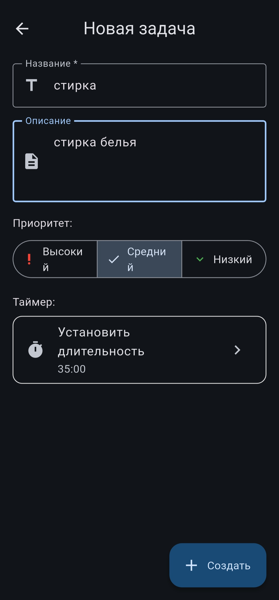
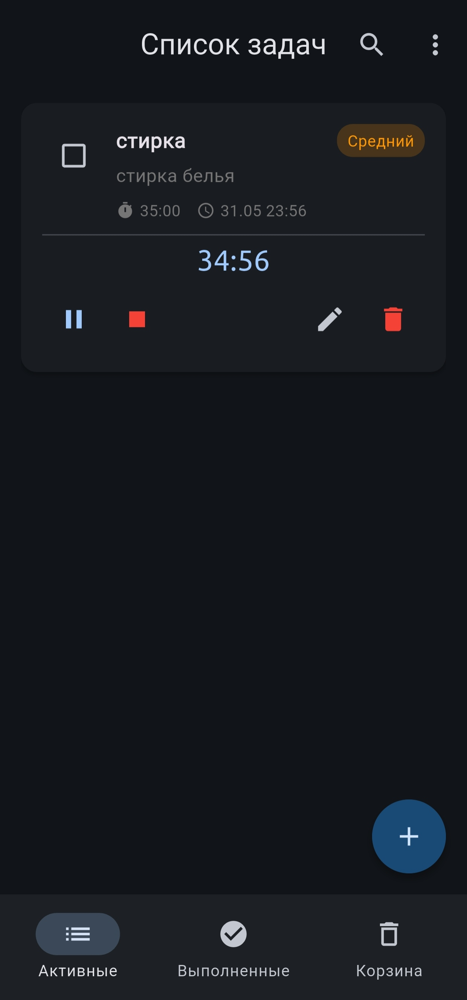
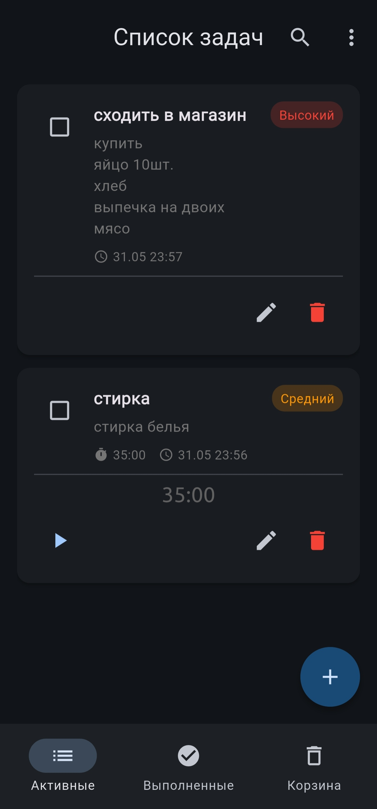
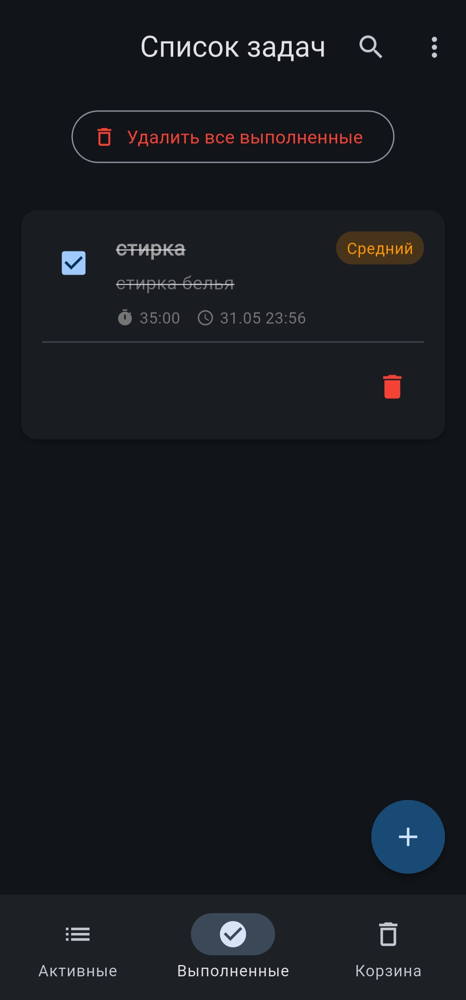
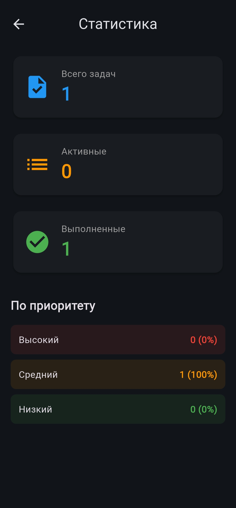
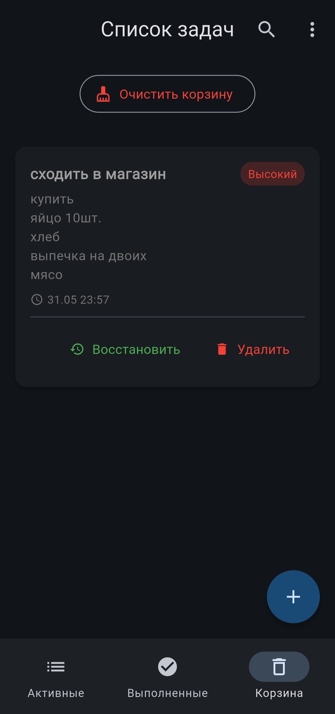

# 📝 Список задач (Tasks)

Удобное Android-приложение для планирования дня, управления задачами и отслеживания продуктивности. Разработано на Flutter с использованием современных паттернов и Material 3.

## 🚀 Функции
- ✅ Создание, редактирование и удаление задач
- ️ Встроенный таймер с уведомлениями и звуковым оповещением
- 📊 Экран статистики по выполненным задачам
- 🔍 Поиск и фильтрация по приоритету (Высокий / Средний / Низкий)
- 🗑️ Корзина с возможностью восстановления
- 🌙 Адаптивная тёмная/светлая тема
- 💾 Локальное хранение данных (SQLite)

## 🛠️ Технологии
- **Flutter** (Dart)
- **Provider** (управление состоянием)
- **SQLite** (`sqflite`) для локальной базы данных
- **Flutter Local Notifications** для фоновых уведомлений
- **AudioPlayers** для звуковых оповещений
- **Material 3** дизайн

## 📦 Установка
1. Клонируйте репозиторий:
   ```
   git clone https://github.com/behruz1229/tasks.git
   cd tasks
   ```
2. Установите зависимости:
```
   flutter pub get
```
3. Запустите приложение
```
   flutter run
```
   
## 📸 Скриншоты
  
  

## 🔒 Безопасность
Все данные хранятся локально на устройстве. Приложение не собирает персональные данные и не требует доступа к интернету.

## 🤝 Вклад в проект
Если вы нашли баг или хотите предложить новую функцию — создайте Issue или Pull Request. Буду рад обратной связи!

## 📄 Лицензия
MIT License
